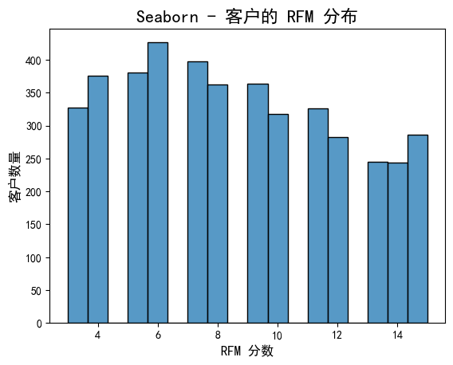

# 🎯目标：通过销售记录进行客户 RFM 计算

使用kaggle数据集 https://www.kaggle.com/datasets/ersany/online-retail-dataset/data  进行的 RFM 计算。

该数据包含许多业务场景常见场景，比如
- 退货
- 空值
- 运费类型
- 手工操作类型
- ...

需要做数据清洗才能获得能够用于计算RFM的干净数据

# 🎯 RFM 结果

